<div align="center">
  <picture>
    <source media="(max-width: 640px)" srcset="./assets/hero-mobile.svg" />
    
  </picture>

  <br />

  <a href="https://www.linkedin.com/in/nicolomanni/"></a>
  <a href="https://github.com/nicolomanni"></a>
  <a href="https://x.com/NikAndMan"></a>
  <a href="http://nicolomanni.com/en/"></a>
</div>

---

### `> whoami`

I turn difficult product and engineering problems into software people can trust. Today, that means building full-stack experiences at [Pareto](https://pareto.credit/) where institutional credit, smart contracts, and thoughtful product design meet.

> [!NOTE]
> **Current signal:** making programmable onchain credit feel simple without pretending the infrastructure underneath it is.

### The system

```text
01 / PRODUCT       dense domains ──────────────▶ human flows
02 / PLATFORM      interface ──▶ API ──▶ smart contracts
03 / PRACTICE      strong types ──▶ tests ──▶ safe evolution
```

My favorite work lives at the intersection of **clear interfaces**, **clean architecture**, and **systems that remain safe to evolve**.

### Core stack

<p>
  
  
  
  
  
  
  
  
  
</p>

### Selected experiments

| Project | Signal | Built with |
| :--- | :--- | :--- |
| [`ngx-playground`](https://github.com/nicolomanni/ngx-playground) | Monorepo architecture and scalable application boundaries | TypeScript · Nx |
| [`hello-contract`](https://github.com/nicolomanni/hello-contract) | Solidity from first principles | Solidity · Hardhat |
| [`dreamweaverstudio`](https://github.com/nicolomanni/dreamweaverstudio) | A product experiment in TypeScript | TypeScript |

### Human in the loop

AI is an increasingly useful part of my workflow—for prototypes, tests, documentation, and faster feedback. The judgment stays human: where responsibilities live, which abstractions will survive, and what a safe failure looks like.

Crypto enthusiast. Sci-fi lover. Proud DeFi farmer. Occasional Flutter evangelist. And yes, you may have noticed the 911.

<div align="center">
  

  <br /><br />

  <strong>Building from Italy, for the open internet.</strong>

  <br /><br />

  <a href="mailto:nicolo.manni@yahoo.com">Say hello</a>
  &nbsp;·&nbsp;
  <a href="https://www.linkedin.com/in/nicolomanni/">Connect on LinkedIn</a>
  &nbsp;·&nbsp;
  <a href="https://pareto.credit/">Explore Pareto</a>
</div>
